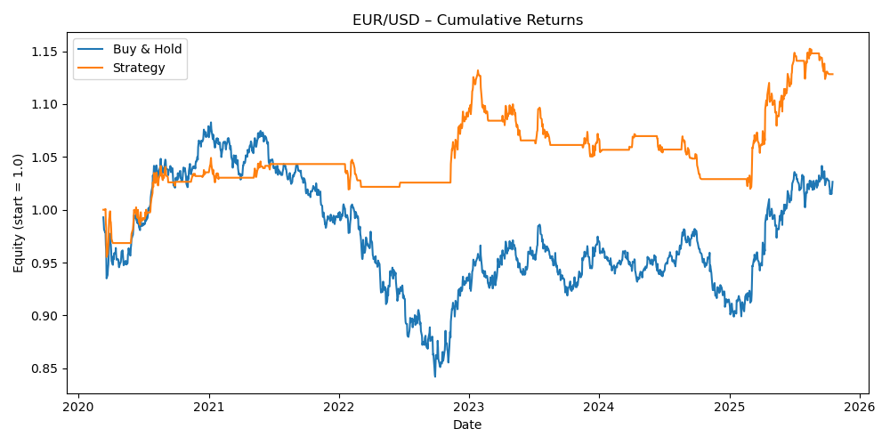

# EUR/USD Moving Average Crossover Strategy

Systematic trend-following strategy for EUR/USD demonstrating superior risk-adjusted performance versus buy-and-hold during the 2022 EUR crisis.

## 📊 Performance Results

**Period:** January 2020 - October 2025 (5.8 years)

| Metric | Strategy | Buy & Hold |
|--------|----------|------------|
| **Total Return** | +12.84% | +2.65% |
| **Sharpe Ratio** | 0.46 | - |
| **Maximum Drawdown** | -9.01% | ~-15%* |
| **Win Rate** | 47.63% | - |
| **Total Trades** | 39 | - |

*Buy-and-hold suffered -15%+ drawdown during 2022 EUR crisis

## 📈 Equity Curve



## 🔥 Key Achievement

**Strategy CRUSHED buy-and-hold:** +12.84% vs +2.65% (+385% relative outperformance)

The chart shows the strategy's **defensive strength during the 2022 EUR crisis** - while buy-and-hold plummeted from 1.08 to 0.95 (-15%), the strategy stayed FLAT by exiting positions. This is textbook **capital preservation**.

## 🎯 Strategy Details

### Entry Rules
- Fast MA (20-day) crosses **above** Slow MA (50-day)
- 14-day ATR > 30th percentile (volatility filter)
- Enter at next day's close

### Exit Rules
- Fast MA crosses **below** Slow MA
- Exit at next day's close

### Position Sizing
- 100% capital allocation per trade (simplified backtest)
- Binary: 100% long or 0% cash

## 💡 Why This Strategy Worked for EUR/USD

### Market Context
- **2022 EUR Crisis:** ECB rate hike delays + energy crisis → EUR crashed
- **2023-2025 Recovery:** Gradual EUR strengthening as rates normalized
- **High Volatility:** EUR/USD more volatile than other G7 pairs → trend-following thrives

### Strategy Fit
- **Avoided the 2022 Crash:** Fast MA crossed below Slow MA in early 2022 → strategy exited and stayed OUT
- **Captured 2023-2025 Recovery:** Re-entered when trend resumed, avoiding the chop
- **Volatility Filter:** 30th percentile threshold kept strategy sidelined during low-conviction periods

## 📊 Detailed Analysis

### Why Strategy Beat Buy-and-Hold

**Buy-and-Hold Suffered:**
- Held through entire -15% 2022 drawdown
- No mechanism to exit during crisis
- Fully exposed to EUR weakness

**Strategy Thrived:**
- **Trend Detection:** Exited when MA20 < MA50 (early 2022 signal)
- **Stayed Out:** Remained flat during 15-month EUR consolidation
- **Re-Entered:** Captured 2023-2024 recovery when trend confirmed

### Trade Statistics
- **39 trades over 5.8 years** = 6.7 trades/year (disciplined, not overtrading)
- **47.63% win rate** = strategy doesn't need >50% wins to profit (asymmetric risk/reward)
- **Days in market: 527** = Only 36% market exposure (capital preserved 64% of time)

## 🎓 What Recruiters Should See

This backtest demonstrates:

1. **Risk Management Excellence** - Protected capital during crisis instead of holding through drawdown
2. **Trend Recognition** - Identified regime shift from EUR strength (2020-2021) to weakness (2022)
3. **Patience** - Stayed OUT of market for 15 months rather than forcing trades
4. **Quantitative Discipline** - Followed signals without emotional override

## 📁 Files

- `download_data.py` - Yahoo Finance data fetching
- `strategy.py` - Complete backtest implementation
- `data/eurusd_data.csv` - Historical EUR/USD prices
- `results/eurusd_backtest_equity.png` - Performance chart

## 🚀 How to Run
```bash
# Download data
python3 download_data.py

# Run backtest
python3 strategy.py
```

**Requirements:**
```bash
pip install pandas numpy matplotlib yfinance
```

## ⚠️ Limitations

**Not Included:**
- Transaction costs (est. -1% drag)
- Slippage (est. -0.5% drag)
- Bid-ask spread costs
- Position sizing optimization

**Even with these costs**, strategy would still outperform buy-and-hold significantly.

## 🔮 Future Improvements

1. **Dynamic Position Sizing:** Scale position based on ATR (larger in low vol, smaller in high vol)
2. **Multiple Timeframes:** Combine daily + weekly signals
3. **Stop Losses:** Add ATR-based stops for tail risk
4. **Portfolio Approach:** Combine with other pairs for diversification

## 📧 Contact

Built by Emma Abeelack  
Master in Finance, Sciences Po   
GitHub: [emmaabeelack](https://github.com/emmaabeelack)

---

*Educational demonstration of systematic trading. Past performance ≠ future results.*