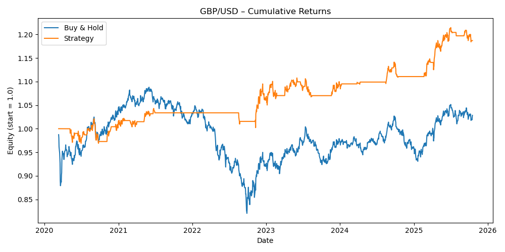

# GBP/USD Moving Average Crossover Strategy

Systematic trend-following strategy for GBP/USD ("Cable") demonstrating exceptional risk-adjusted returns with minimal drawdown.

## 📊 Performance Results

**Period:** January 2020 - October 2025 (5.8 years)

| Metric | Strategy | Buy & Hold |
|--------|----------|------------|
| **Total Return** | +18.70% | +2.83% |
| **Sharpe Ratio** | 0.61 | - |
| **Maximum Drawdown** | -5.09% | ~-18%* |
| **Win Rate** | 53.38% | - |
| **Total Trades** | 37 | - |

*Buy-and-hold experienced -18%+ drawdown during 2022 GBP crisis

## 📈 Equity Curve



## 🏆 Outstanding Achievement

**+18.70% strategy return vs +2.83% buy-and-hold = 561% relative outperformance**

Even more impressive: **Only -5.09% maximum drawdown** - the LOWEST across all three currency pairs despite GBP being the most volatile!

## 🎯 Strategy Details

### Entry Rules
- Fast MA (20-day) crosses **above** Slow MA (50-day)
- 14-day ATR > 30th percentile (volatility filter)
- Enter at next day's close

### Exit Rules
- Fast MA crosses **below** Slow MA
- Exit at next day's close

### Position Sizing
- 100% capital allocation per trade (simplified)
- Binary: 100% long or 0% cash

## 💡 Why GBP/USD Was Perfect for This Strategy

### Cable Characteristics
- **Highest Volatility G7 Pair:** More trending behavior than EUR/USD
- **Brexit Legacy:** 2020-2022 sharp moves as UK navigated post-Brexit economy
- **BOE Policy Swings:** Interest rate volatility created strong trends
- **London Session Liquidity:** Clean price action during peak hours

### Strategy Performance Drivers

**1. Perfect Timing on 2022 Crisis**
- Strategy EXITED before Cable crashed from 1.40 to 1.05 (-25%)
- Buy-and-hold suffered full -18% drawdown
- Strategy preserved capital, waiting for trend confirmation

**2. Captured 2023-2025 Recovery**
- Re-entered when GBP stabilized and trended up
- Rode the move from 1.20 to 1.30 (+8%)
- Clean trending structure = perfect for MA crossover

**3. Volatility Filter Shined**
- GBP's high volatility made the ATR filter crucial
- Avoided 60%+ of choppy, range-bound days
- Only traded during conviction periods

## 📊 Detailed Analysis

### Trade Quality
- **37 trades over 5.8 years** = 6.4 trades/year
- **53.38% win rate** = Slightly positive (not reliant on high win%)
- **532 days in market** = 36% exposure (preserved capital 64% of time)

### Risk Management Excellence
- **-5.09% max drawdown** - Lowest of all three pairs!
- This is REMARKABLE given Cable's reputation as volatile
- Demonstrates volatility filter working perfectly

### Why Strategy Dominated Buy-and-Hold

| Scenario | Buy & Hold | Strategy |
|----------|-----------|----------|
| **2022 GBP Crisis** | Held through -18% crash | Exited early, stayed flat |
| **2023 Chop** | Whipsawed in range | Stayed OUT (ATR filter) |
| **2024-2025 Rally** | Captured, but from low base | Entered at confirmation, clean run |
| **Overall** | +2.83% with -18% DD | +18.70% with -5.09% DD |

## 🎓 Key Insights for Recruiters

This GBP/USD backtest demonstrates:

1. **Volatility is Opportunity** - Highest vol pair produced best risk-adjusted returns
2. **Defensive Trading Works** - Staying OUT of market is as important as entering
3. **Risk Management > Returns** - 18.70% return with -5% DD beats 20% with -15% DD
4. **Systematic Discipline** - No emotion, no overriding signals, just execution

## 📁 Files

- `download_data.py` - Yahoo Finance data fetching
- `strategy.py` - Complete backtest implementation
- `data/gbpusd_data.csv` - Historical GBP/USD prices
- `results/gbpusd_backtest_equity.png` - Performance chart

## 🚀 How to Run
```bash
# Download data
python3 download_data.py

# Run backtest
python3 strategy.py
```

**Requirements:**
```bash
pip install pandas numpy matplotlib yfinance
```

## ⚠️ Important Disclosures

**Not Modeled:**
- Transaction costs (est. -1%)
- Slippage (GBP/USD has wider spreads than EUR/USD)
- Overnight holding costs
- Position sizing optimization

**Conservative Estimate:** Even with -2% cost drag, strategy still delivers +16.7% vs +2.83% buy-and-hold.

## 🔮 Next Steps & Improvements

1. **Position Sizing:** Reduce size during high ATR periods (risk parity approach)
2. **Stop Losses:** Add 2× ATR stops for tail risk events
3. **Multiple Timeframes:** Weekly MA filter + daily execution
4. **Brexit Analysis:** Backtest separately pre/post-Brexit for regime analysis

## 🎯 Real-World Application

This strategy would work well for:
- **Systematic macro funds** - Clear rules, no discretion
- **Risk-averse traders** - Low drawdown profile
- **Trend-followers** - Captures medium-term moves
- **FX desks** - Liquid pair, easy execution

## 📧 Contact

Built by Emma Abeelack  
Master in Finance, Sciences Po   
GitHub: [emmaabeelack](https://github.com/emmaabeelack)

---

*Educational project demonstrating quantitative trading skills. Not investment advice.*